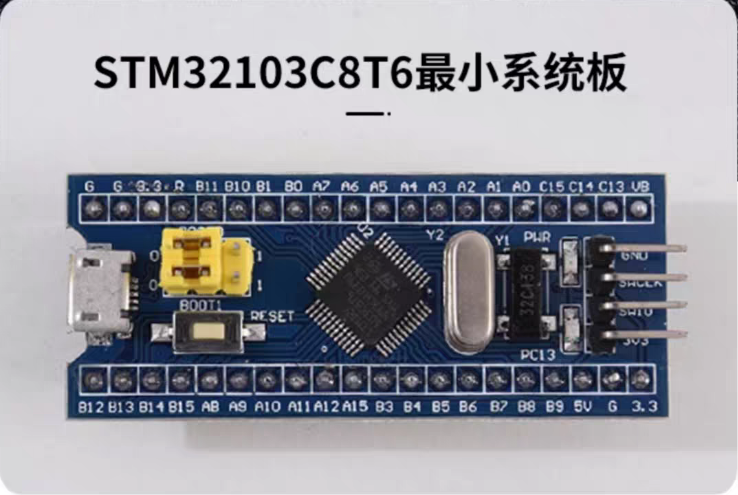
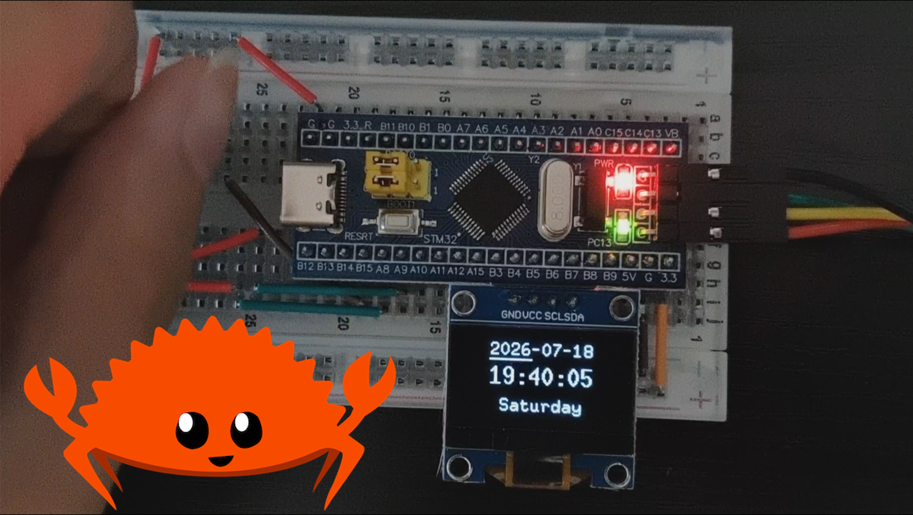
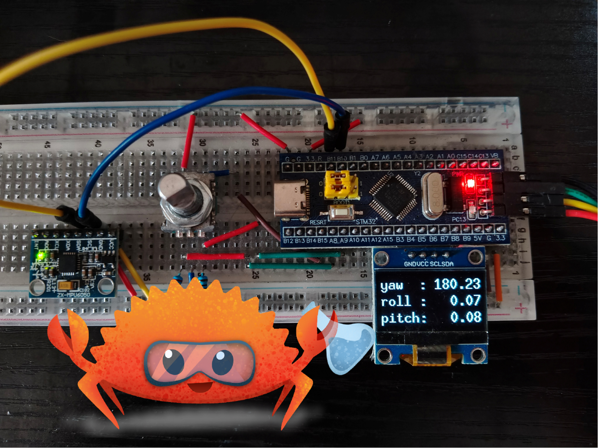

# Rust Embassy STM32F1 嵌入式项目集

 *STM32F103C8T6 最小系统板*

## 概述

本项目集使用 Rust 的 Embassy 框架在 STM32F103 Blue Pill 开发板上实现多种嵌入式应用。

## 项目列表

| 项目名称 | 简介 | 效果图 | 运行命令 |
|----------|------|--------|----------|
| **万年历系统** | 实现完整的日历/时钟系统，支持日期显示和时间调整 |  | `cargo run --bin calendar --release` |
| **姿态解算系统** | 使用 MPU6050 传感器实现姿态检测和欧拉角显示 |  | `cargo run --bin imu --release` |

## 开发环境

### 硬件要求
- STM32F103C8T6 Blue Pill 开发板
- ST-LINK 调试器
- 项目特定外设：
  - 万年历：SSD1306 OLED + 旋转编码器
  - 姿态解算：MPU6050 传感器

## 快速开始

1. 克隆仓库：
   ```bash
   git clone https://github.com/yhy-lk/rust-embassy-stm32f1.git
   cd rust-embassy-stm32f1
   ```
2. 选择并运行项目：
   ```bash
   # 运行万年历项目
   cargo run --bin calendar --release
   
   # 运行姿态解算项目
   cargo run --bin imu --release
   ```

## 项目架构

```
rust-embassy-stm32f1/
├── src/
│   ├── bin/                # 可执行项目入口
│   │   ├── calendar.rs     # 万年历主程序
│   │   ├── imu.rs          # 姿态解算主程序
│   │   └── ...             # 其他项目入口
│   │
│   ├── hardware/           # 硬件抽象层
│   │   ├── gpio_led.rs     # LED 显示驱动
│   │   ├── mpu6050_madgwick_solver.rs      # MPU6050 传感器驱动
│   │   └── ...             # 其他硬件驱动
│   │
│   └── lib.rs              # 公共模块和库
│
├── examples/               # 示例和测试代码
├── dependencies/           # 依赖库
├── Cargo.toml              # 项目依赖管理
└── ...                     # 其他文件（夹）
```

## 学习资源

- [Rust 嵌入式编程指南](https://docs.rust-embedded.org/book/)
- [Embassy 框架文档](https://embassy.dev/book/)
- [STM32F1 参考手册](https://www.st.com/resource/en/reference_manual/cd00171190-stm32f101xx-stm32f102xx-stm32f103xx-stm32f105xx-and-stm32f107xx-advanced-arm-based-32-bit-mcus-stmicroelectronics.pdf)

## 许可证

MIT 许可证 - 详见 [LICENSE](LICENSE) 文件